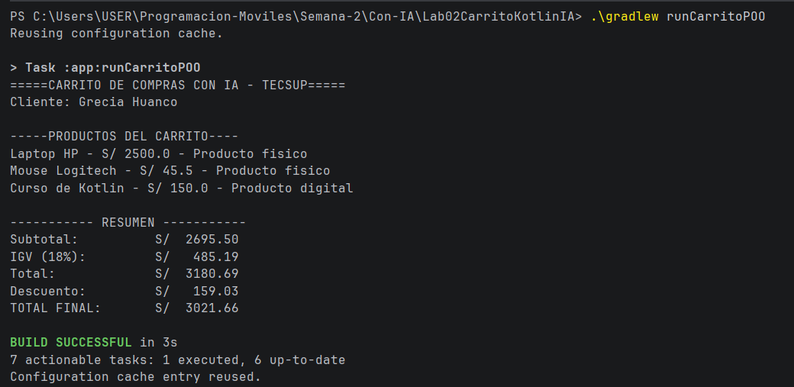

# Laboratorio 02 - Carrito de Compras con IA

## Estudiante
Grecia Huanco

## Descripción
Este proyecto implementa un carrito de compras en Kotlin utilizando Programación Orientada a Objetos.

## Prompt utilizado con IA
Desarrollar un carrito de compras sencillo en Kotlin aplicando Programación Orientada a Objetos.

- Crear una clase general Producto.
- Tener productos físicos y digitales.
- Aplicar abstracción, herencia, encapsulamiento y polimorfismo.
- Permitir agregar productos a un carrito.
- Mostrar los productos registrados.
- Calcular el subtotal.
- Calcular el IGV del 18%.
- Calcular el total.
- Aplicar descuentos usando when:
  - Mayor a 5000: 10%.
  - Mayor a 3000: 5%.
  - En otros casos: sin descuento.
- Mostrar el total final.

El resultado debe ser un programa funcional en Kotlin que muestre los productos del carrito, diferencie productos físicos y digitales, realice los cálculos correspondientes y permita identificar claramente los cuatro pilares de la Programación Orientada a Objetos.

## Resultado de ejecución

