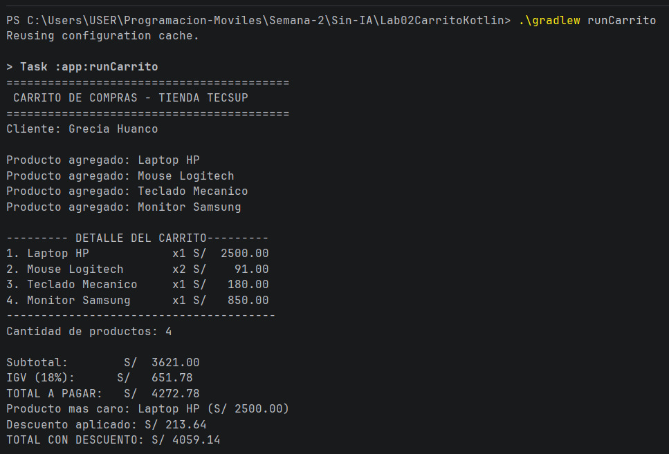

# Laboratorio 02 - Carrito de Compras en Kotlin

## Estudiante
Grecia Huanco

## Descripción
Este programa implementa un carrito de compras utilizando Kotlin. Permite almacenar productos con su nombre, precio y cantidad, calcular el subtotal, el IGV, el total y aplicar un descuento según el monto de la compra.

También muestra el detalle de los productos con columnas alineadas e identifica el producto más caro del carrito.

## Funciones implementadas

- `calcularSubtotal()`: calcula el subtotal de los productos del carrito.
- `calcularIGV()`: calcula el IGV del 18%.
- `calcularTotal()`: calcula el total sumando el subtotal y el IGV.
- `mostrarDetalle()`: muestra el detalle de los productos con columnas alineadas y montos con dos decimales.
- `calcularDescuento()`: calcula el descuento según el monto total utilizando `when`.
- `maxByOrNull`: permite identificar el producto con mayor precio.

## Resultado de la ejecución

## Diferencia entre val y var

En Kotlin, `val` se utiliza para declarar una variable cuyo valor no puede ser reasignado después de su inicialización.

En cambio, `var` se utiliza cuando el valor de una variable puede cambiar durante la ejecución del programa.

En este laboratorio se utiliza `val` para valores que no necesitan cambiar, como el nombre y el precio de un producto, y `var` para valores que pueden modificarse, como la cantidad de un producto.
