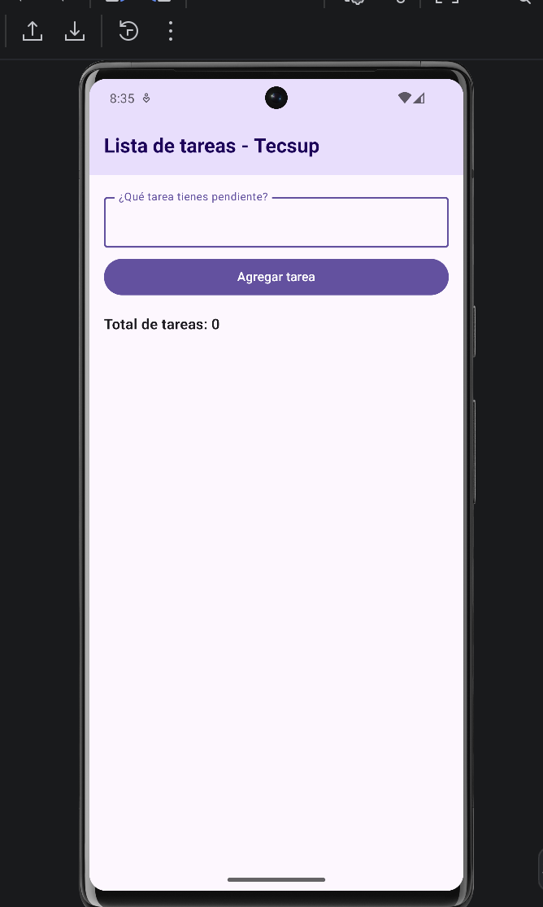
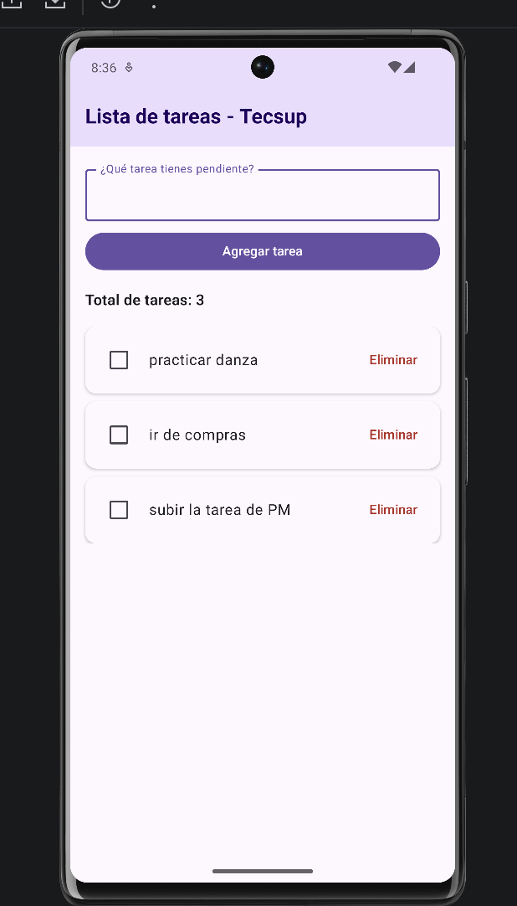
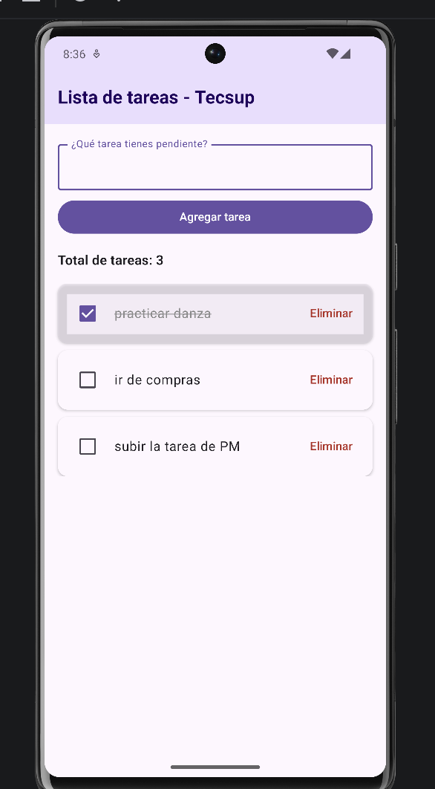
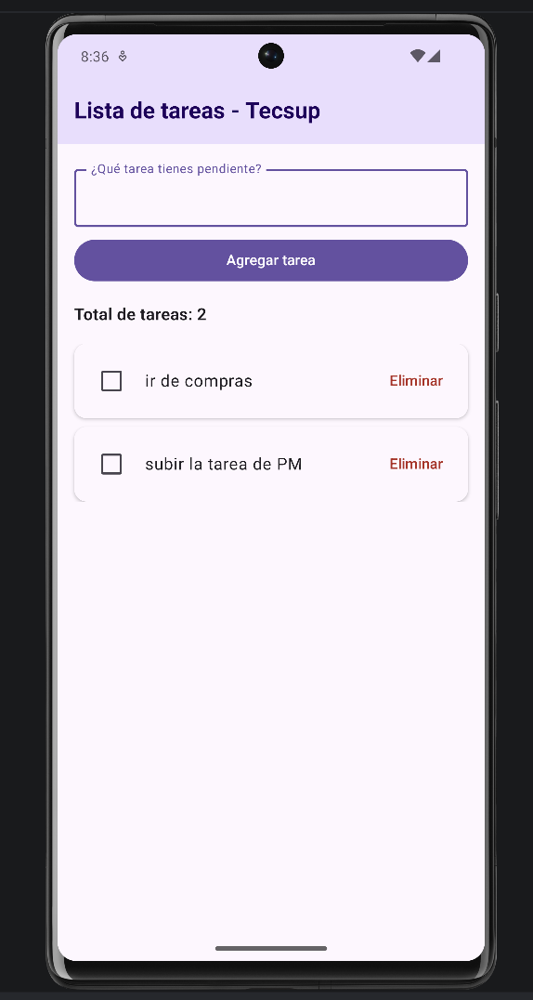

# ListaTareasIA

## Descripción

La aplicación permite gestionar una lista de tareas utilizando manejo de estados en Jetpack Compose. En esta versión se utilizó el Chat de Gemini integrado en Android Studio como apoyo para mejorar la presentación de la interfaz

## Funcionalidades

- Ingresar una nueva tarea
- Agregar tareas a la lista
- Visualizar el total de tareas registradas
- Marcar una tarea como completada mediante un Checkbox
- Eliminar tareas
- Actualizar automáticamente la interfaz cuando cambia el estado

## Uso de IA

Se utilizó Gemini en Android Studio para mejorar la presentación de la aplicación, manteniendo las funcionalidades y el manejo de estados desarrollados previamente.

La interfaz resultante incluye el título Lista de tareas - Tecsup, un campo para ingresar tareas, un botón para agregarlas, el total de tareas y tarjetas para mostrar cada elemento de la lista.

### Prompt utilizado
Actúa como desarrollador Android especializado en Jetpack Compose.

Necesito que mejores la presentación de mi aplicación de lista de tareas para que tenga el título "Lista de tareas - Tecsup", un campo de texto con la etiqueta "¿Qué tarea tienes pendiente?", un botón "Agregar tarea", el total de tareas y una lista donde cada tarea se muestre dentro de una tarjeta con un Checkbox y una opción para eliminar.

Esto está dirigido a una aplicación académica desarrollada en Kotlin con Jetpack Compose.

Quiero que respondas mostrando el código necesario para modificar mi MainActivity.kt.

Ten en cuenta estas condiciones: conserva el manejo de estados existente con remember, mutableStateOf y mutableStateListOf; las tareas deben poder agregarse, marcarse como completadas y eliminarse; utiliza Material 3 y no agregues librerías externas.

## Evidencias

### Pantalla principal

### Agregando tareas

### Tarea marcada como completada

### Eliminando una tarea
