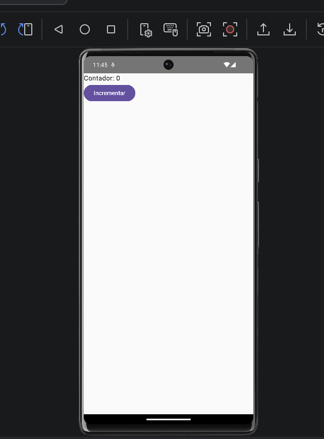

# Contador sin Remember

## Descripción

Aplicación desarrollada en Jetpack Compose para comprobar el comportamiento de una variable normal sin utilizar `remember`.

## Funcionamiento

La aplicación muestra un contador inicializado en **0** y un botón **Incrementar**.

Al presionar el botón, el valor mostrado en pantalla no aumenta porque `contador` no está siendo manejado como un estado observable de Jetpack Compose.

## Resultado

El contador permanece visualmente en **0** al presionar el botón **Incrementar**.

## Evidencia

