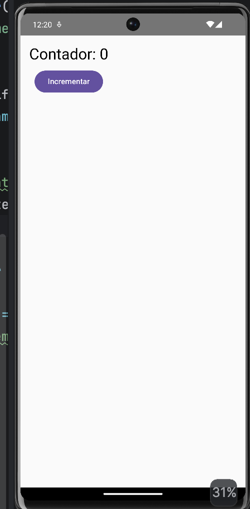
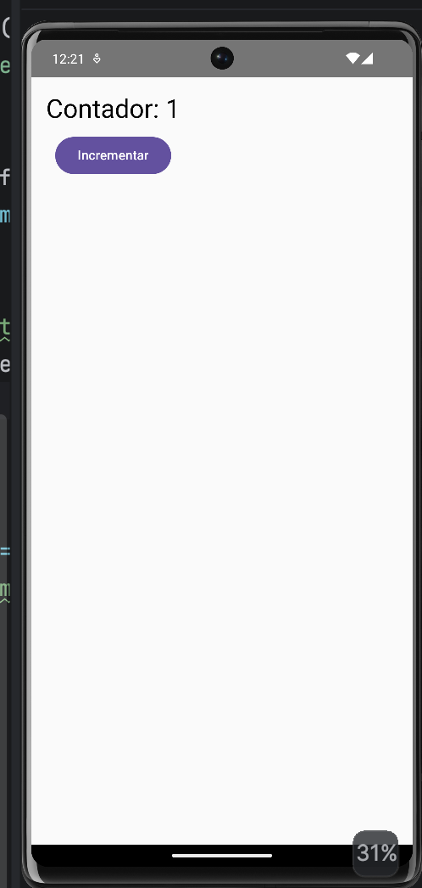

# Contador con Remember

## Descripción

Aplicación desarrollada para comprobar el manejo de estado utilizando `remember` y `mutableStateOf`.

## Funcionamiento

La aplicación muestra un contador inicializado en **0** y un botón **Incrementar**.

Al presionar el botón, el contador aumenta de uno en uno y la interfaz se actualiza automáticamente.

## Resultado

El contador aumenta de uno en uno al presionar el botón **Incrementar**, debido al uso de `remember` y `mutableStateOf`.

## Evidencia1 (muestra el contador en 0)

## Evidencia2 (muestra el contador en 1)

