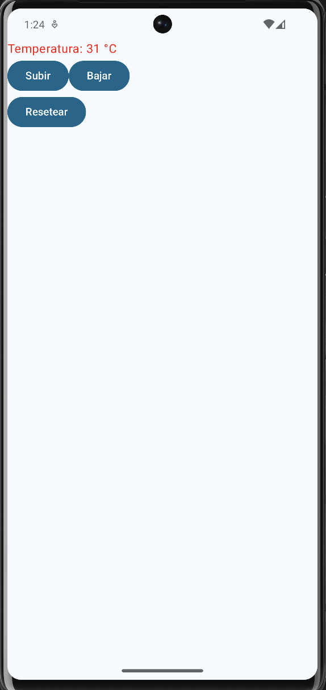
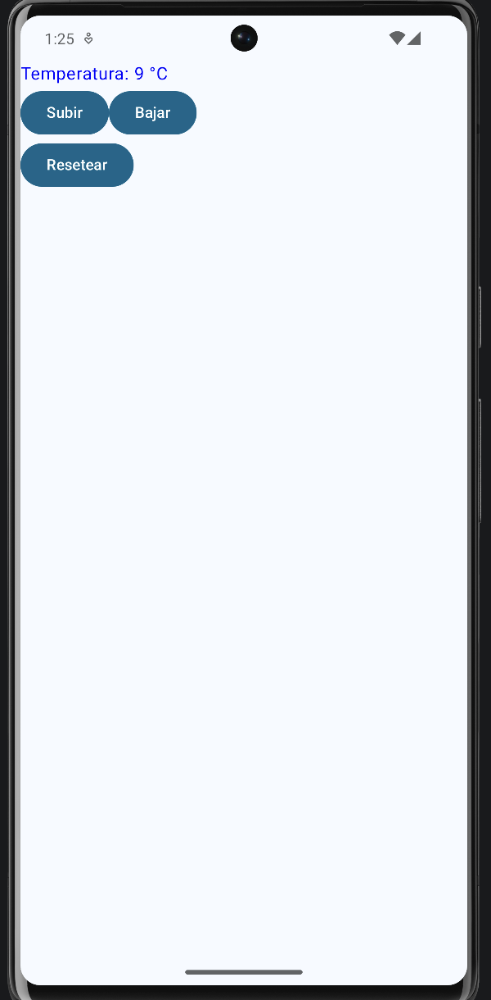
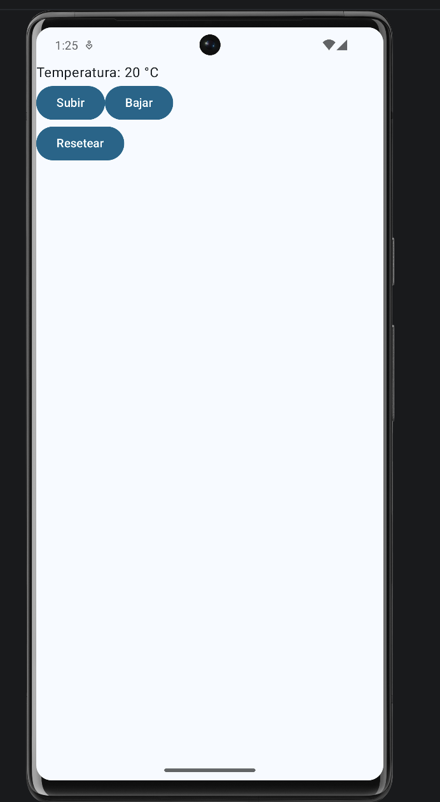

# TemperatureDisplay

## Descripción
La aplicación permite modificar una temperatura mediante botones y actualizar automáticamente su valor en pantalla

## Funcionalidades

- La temperatura inicia en 20 °C
- El botón Subir aumenta la temperatura
- El botón Bajar disminuye la temperatura
- El botón Resetear devuelve la temperatura a 20 °C
- Si la temperatura es mayor a 30 °C, el texto cambia a color rojo
- Si la temperatura es menor a 10 °C, el texto cambia a color azul

## Evidencias

### Pantalla principal
La aplicación inicia con una temperatura de 20 °C

### Temperatura mayor a 30 °C
Al superar los 30 °C, la temperatura se muestra en color rojo

### Temperatura menor a 10 °C
Al disminuir por debajo de los 10 °C, la temperatura se muestra en color azul

### Resetear temperatura
Al presionar Resetear, la temperatura vuelve a su valor inicial de 20 °C

