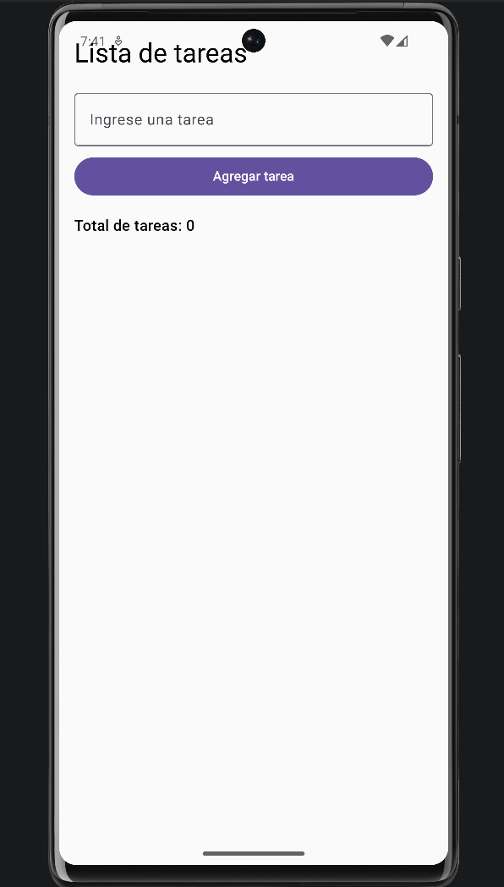
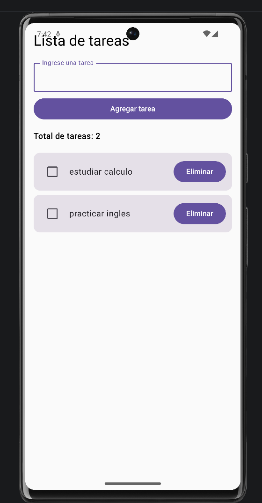
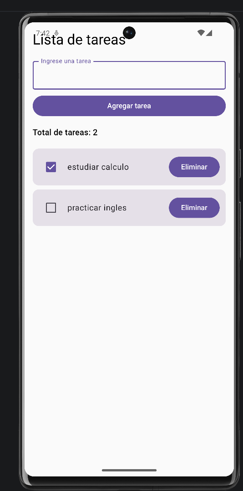
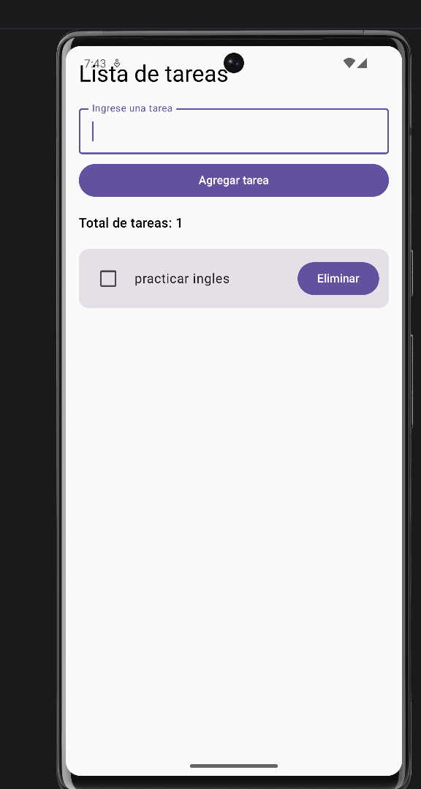

# Lista de Tareas

## Descripción

La aplicación permite registrar tareas y reflejar automáticamente los cambios realizados en la interfaz

## Funcionalidades

- Escribir una nueva tarea.
- Agregar tareas a una lista.
- Visualizar el total de tareas registradas.
- Marcar una tarea como completada mediante un Checkbox.
- Eliminar tareas de la lista.

## Resultado

La aplicación actualiza automáticamente la interfaz cuando se agrega, completa o elimina una tarea.

## Evidencias

### Pantalla principal

### Agregando tareas

### Tarea marcada como completada

### Eliminando una tarea

