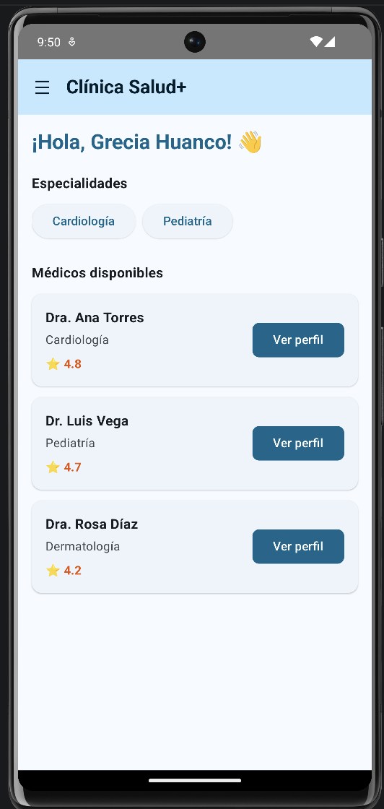
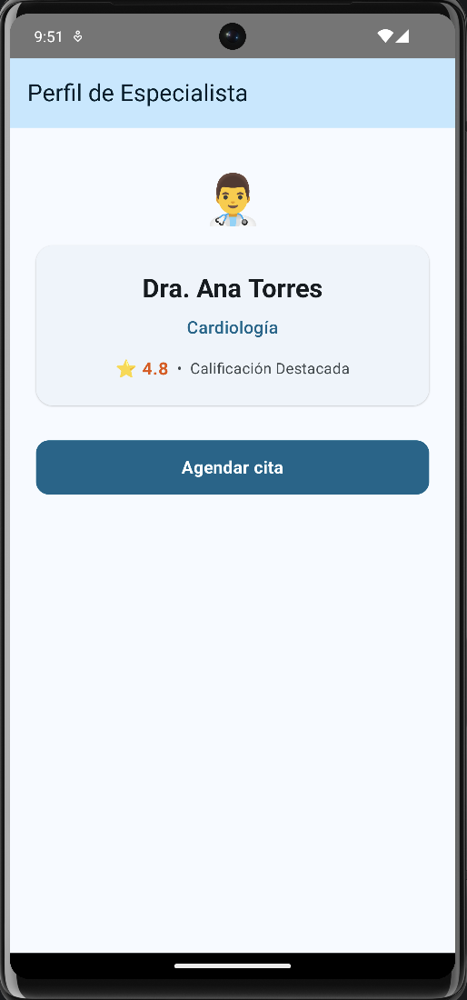
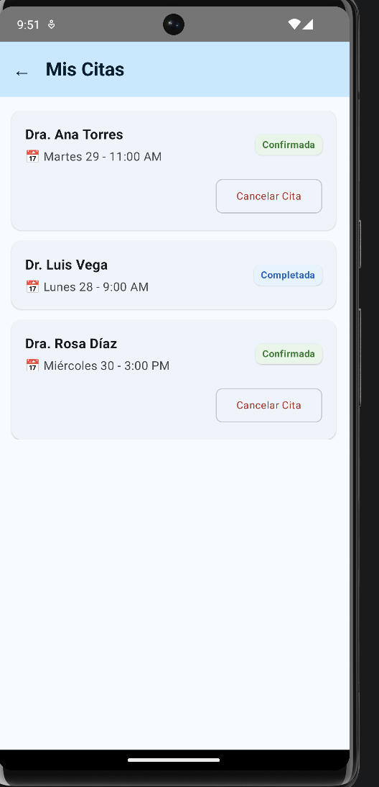

# Prompts utilizados con IA

## Prompt 1 - Mejora de la pantalla de inicio
Considera que sé un poco de aplicaciones móviles y quiero mejorar la pantalla de inicio de mi aplicación Clínica Salud+. Quiero que se vea más ordenada, bonita y fácil de entender, pero sin hacer muchos cambios en el código que ya tengo. Quiero mantener mi LazyRow de especialidades, mi LazyColumn de médicos, el menú lateral y la navegación que ya funciona. Me gustaría que los médicos se vean mejor organizados, mostrando por separado su nombre, especialidad y calificación, y que tengan un botón para ver su perfil. No quiero usar ViewModel, MVVM ni cosas avanzadas que todavía no he aprendido. Realiza los cambios principalmente en PantallaInicio.kt y mantén la lógica que ya tengo

### Mejora realizada

## Prompt 2 - Mejora del perfil del médico y agendamiento
Ahora quiero mejorar las pantallas de perfil del médico y agendar cita, quiero que se vean más ordenadas y bonitas pero sin hacer muchos cambios en el código que ya tengo, en el perfil del médico quiero organizar mejor el nombre, la especialidad y la calificación manteniendo el botón "Agendar cita", y en la pantalla de agendar cita quiero que las opciones de fecha y horario se vean más claras y organizadas, manteniendo las 3 fechas, los 3 horarios y la selección única que ya funciona, también quiero mantener la navegación y la lógica actual sin agregar cosas muy avanzadas que todavía no hemos usado

### Mejora realizada

## Prompt 3 - Mejora de las demás pantallas
Ahora quiero mejorar las demás pantallas que todavía se ven muy simples, quiero que la pantalla de confirmación muestre de una forma más ordenada el médico, la fecha y la hora de la cita, también quiero mejorar Mis citas para que cada cita se vea mejor organizada manteniendo los colores de Confirmada y Completada, y agregar una opción para cancelar una cita mostrando antes un AlertDialog para confirmar si realmente quiero cancelarla, además quiero mejorar un poco Historial médico y Perfil para que la información se vea más ordenada y bonita, pero sin hacer cambios grandes ni modificar la navegación y la lógica que ya funciona, tampoco quiero usar ViewModel, MVVM ni cosas avanzadas que todavía no hemos usado

### Mejora realizada
