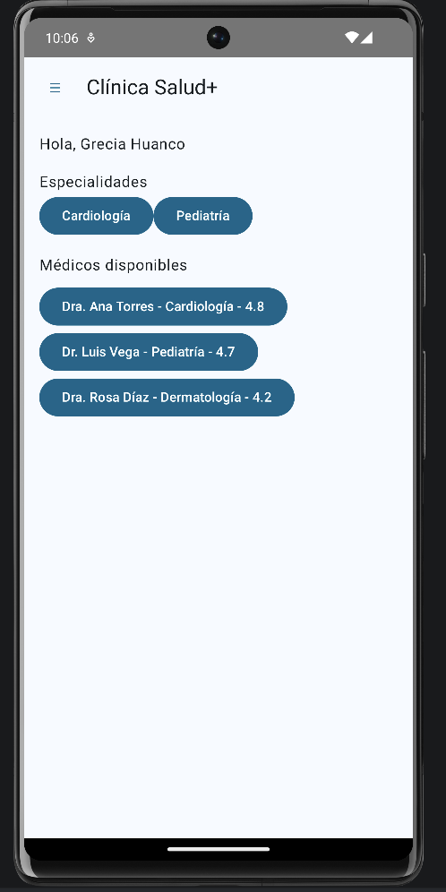
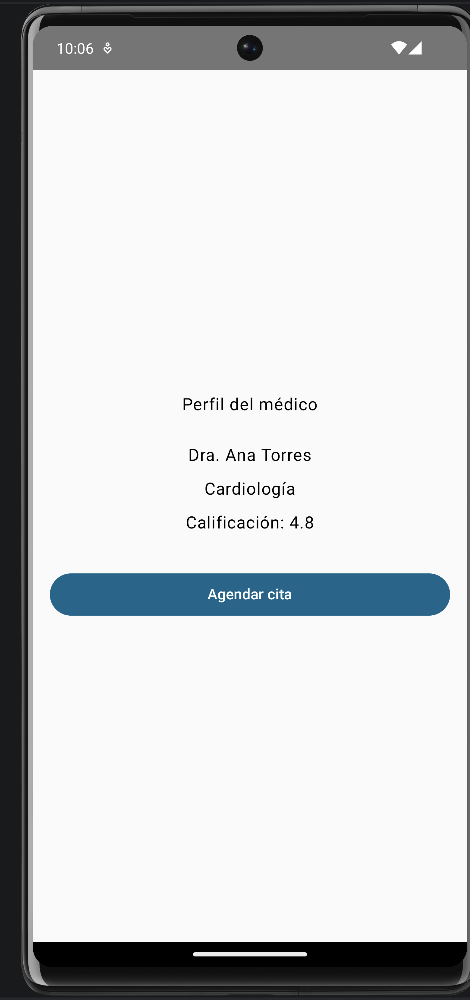
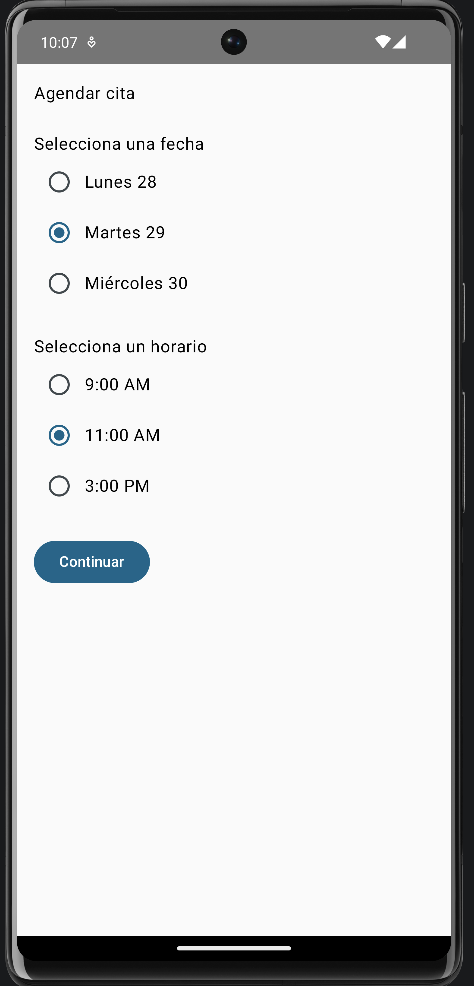
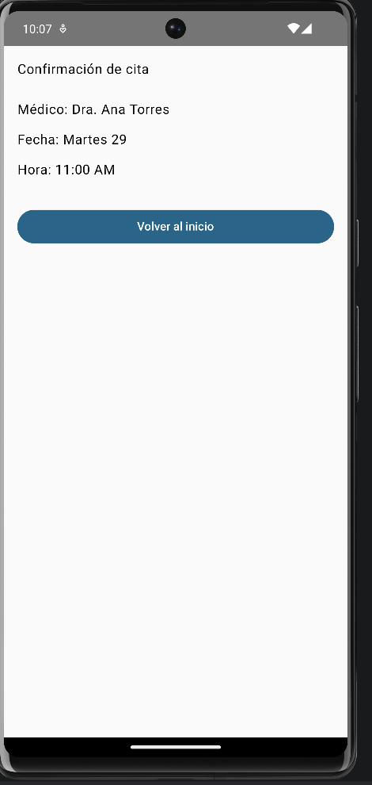
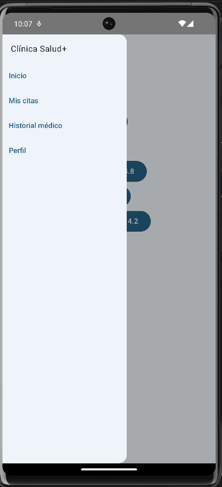
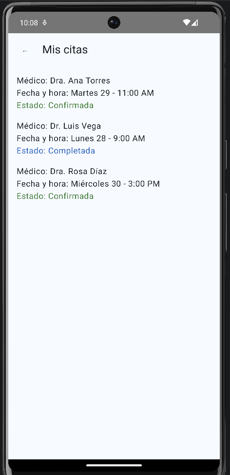
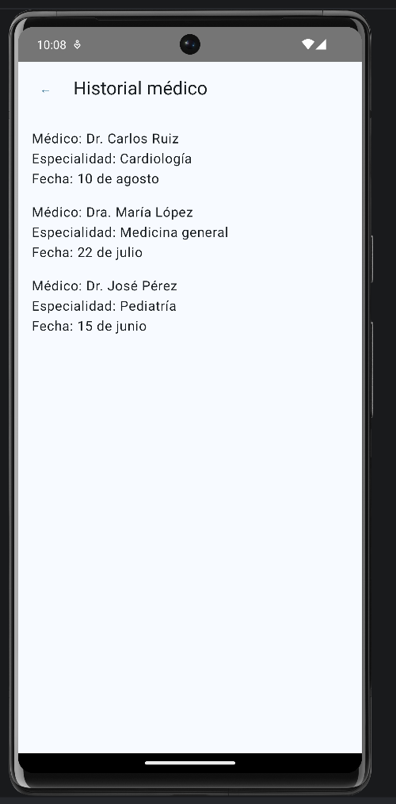
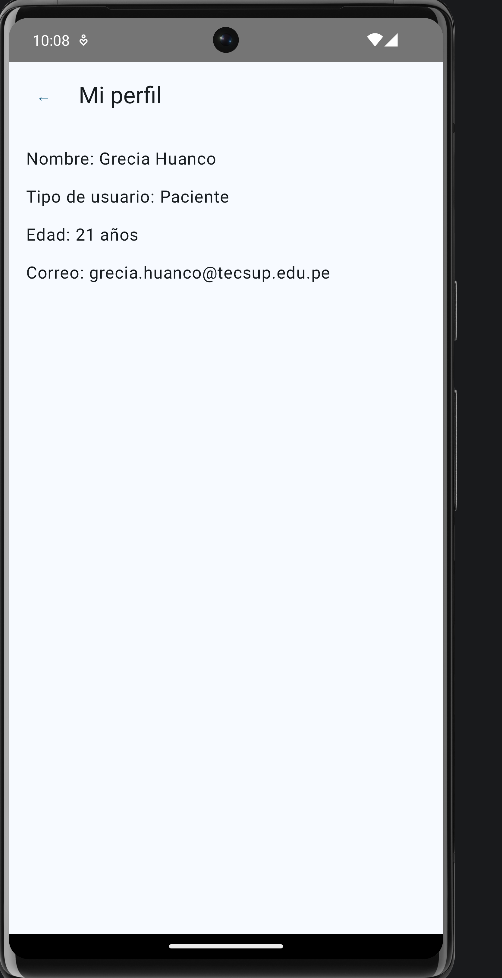

# Clínica Salud+

## Evidencias

### Pantalla de Inicio

### Perfil del médico

### Agendar cita

### Confirmación de cita

### Menú lateral

### Mis citas

### Historial médico

### Mi perfil

## Preguntas para la sustentación

### 1. ¿Cómo llega el médico elegido en Inicio hasta la pantalla de confirmación? Describe la ruta completa del dato.

Cuando selecciono un médico en Inicio, sus datos se pasan como parámetros mediante la navegación hacia Perfil del médico. Luego, al presionar "Agendar cita", el nombre del médico pasa a la pantalla de agendamiento. Ahí selecciono una fecha y un horario de las opciones que ya están definidas en el código y estos datos se envían a la pantalla de Confirmación.

La ruta es:

Inicio → Perfil del médico → Agendar cita → Confirmación.

Los datos se pasan entre las pantallas mediante las rutas de navegación. No se utiliza una base de datos, ya que los datos de esta aplicación son estáticos.

### 2. ¿Por qué el drawer se declara envolviendo el Scaffold, y no como un parámetro más de Scaffold?

Porque Scaffold no tiene un parámetro para colocar directamente un drawer. Por eso utilizamos ModalNavigationDrawer envolviendo al Scaffold. El drawer controla el menú lateral y el Scaffold organiza la estructura de la pantalla, como el TopAppBar y el contenido.

### 3. ¿Por qué la selección de fecha y hora se comporta como un RadioButton, aunque visualmente sean "chips"?

Porque solo se puede tener una fecha y un horario seleccionados a la vez. Cuando selecciono otra opción, esta reemplaza a la anterior. Las fechas y horarios ya están definidos de forma estática en el código, pero utilizamos estado para saber cuál opción seleccionó el usuario.

### 4. ¿Qué tuviste que corregir del código que te generó la IA para tu mejora de la Fase 2?

Principalmente revisé que los cambios de la IA mantuvieran la lógica que ya tenía la aplicación y que no agregaran cosas avanzadas que todavía no hemos trabajado. También probé que la navegación y la selección de fecha y horario siguieran funcionando correctamente.

Para la mejora de cancelar una cita, verifiqué que primero aparezca un AlertDialog de confirmación y que la cita se quite de la lista solamente durante la ejecución de la aplicación. Como la aplicación es estática y no utiliza una base de datos, este cambio no queda guardado permanentemente.