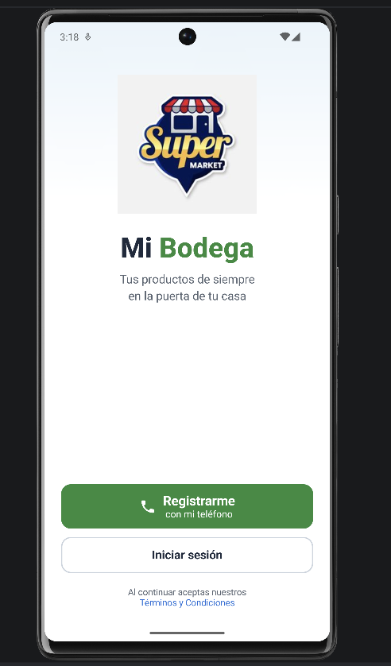
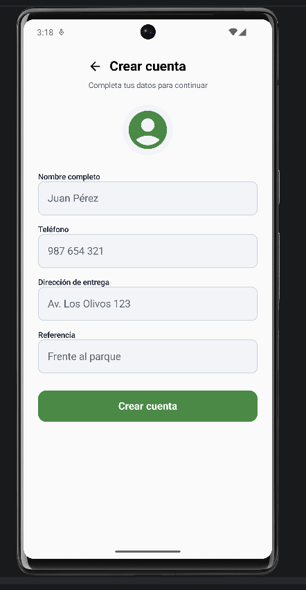
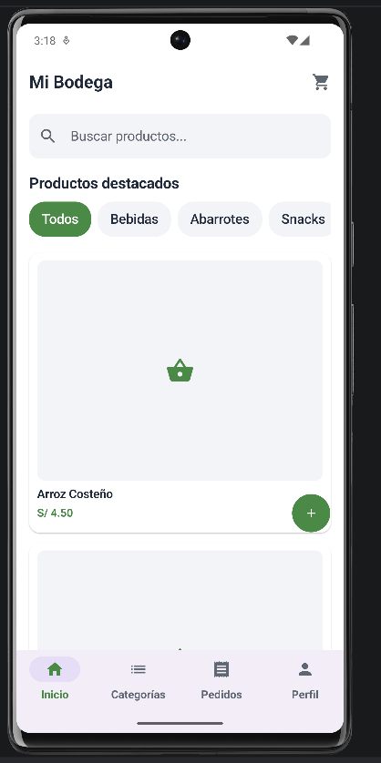
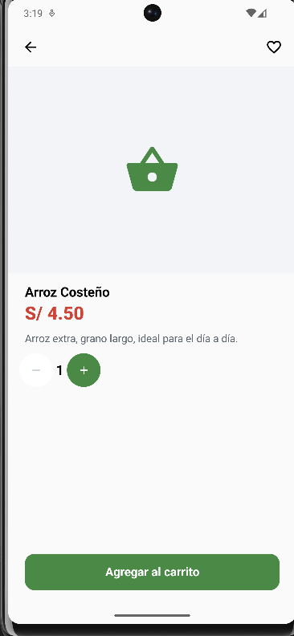
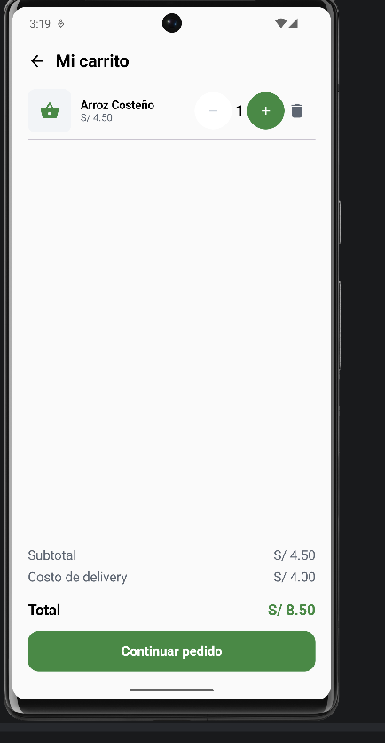
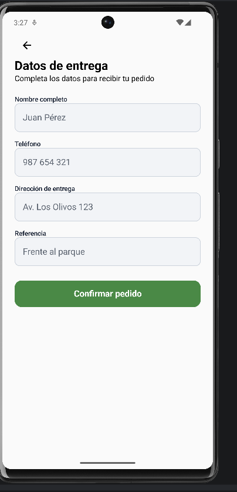
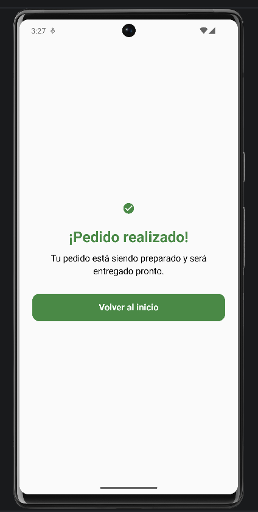

# Mi Bodega — App Cliente

Aplicación móvil desarrollada en Kotlin con Jetpack Compose como tarea complementaria del Laboratorio 6 del curso Programación en Móviles.

## Evidencias

### 1. Inicio de sesión

### 2. Registro del cliente

### 3. Pantalla de inicio

### 4. Detalle del producto

### 5. Carrito de compras

### 6. Datos de entrega

### 7. Confirmación del pedido

